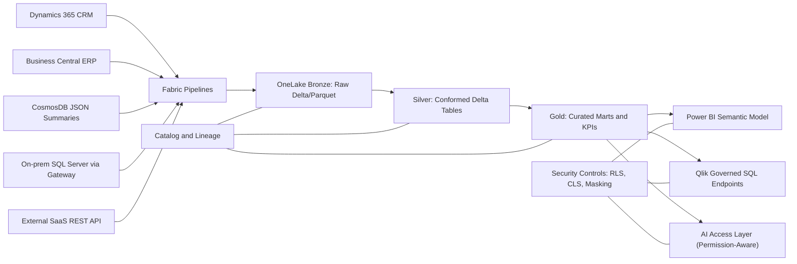
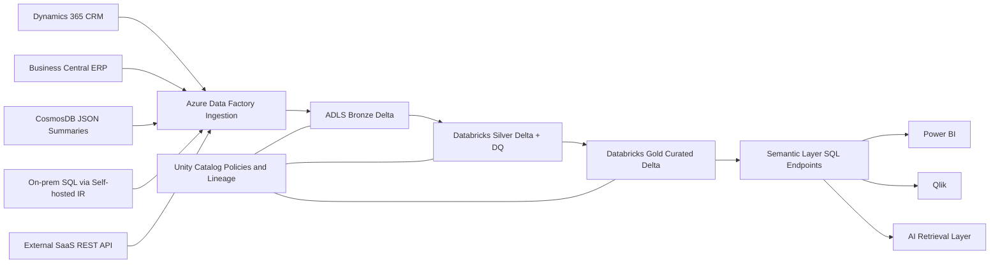

# Part 1 - Architecture Design Case (Shimon Ltd.)

Date: 2026-06-24
Scope: End-to-end platform design from source to BI and AI

## Context and Design Goals
Shimon Ltd. needs one enterprise platform that supports governed BI and AI-assisted document analytics across CRM, ERP, CosmosDB summaries, on-prem SQL Server, and external SaaS APIs. The solution must meet the 08:00 reporting SLA, respect a monthly cloud budget cap of approximately 25,000 USD, protect PII and financial data, and stay maintainable by a small internal team.

## 1.1 End-to-End Architecture and Two Alternatives

### Alternative A - Microsoft Fabric-first (Recommended)

Architecture summary:
1. Source ingestion is orchestrated in Fabric pipelines with hybrid connectivity for on-prem SQL.
2. Data lands in OneLake medallion layers and is transformed incrementally.
3. Gold layer publishes governed business tables and semantic metrics.
4. Power BI is primary consumption, Qlik consumes governed endpoints, AI consumes permission-filtered data with provenance.

### Alternative B - Databricks-first on Azure (Chosen comparator)

Why this comparison is fair:
1. It stays on Azure, so networking/compliance context is comparable.
2. It is a realistic non-Fabric path for analytics and AI scale.
3. It isolates platform trade-offs rather than cloud-provider differences.

### Comparison Matrix

| Dimension | Alternative A: Fabric-first | Alternative B: Databricks-first |
|---|---|---|
| Cost | Lower initial platform and ops overhead for this team profile. Better fit for constrained monthly spend if scope is disciplined. | Strong performance flexibility but can become costlier with always-on clusters and specialized engineering needs. |
| Scalability | Strong for current volume profile and BI-first patterns. | Excellent for high-scale engineering and advanced ML workloads. |
| Complexity | Lower implementation complexity due to integrated stack and native Power BI alignment. | Higher complexity across orchestration, governance layers, and platform operations. |
| Governance | Integrated governance patterns are easier to operationalize quickly. | Very strong governance with Unity Catalog, but operational maturity requirements are higher. |
| BI Integration | Best native path for Power BI and semantic governance. | Good integration, but usually more engineering steps to standardize semantic contracts. |
| AI-readiness | Good for governed AI over curated data and summaries in MVP. | Stronger for advanced AI and feature engineering depth beyond MVP. |
| Implementation effort | Faster path to week-6 value and 12-week target. | More setup and specialist engineering; higher delivery risk in short timeline. |
| Risk | Lower delivery and run risk for small team; moderate vendor concentration risk. | Higher delivery and run risk with this team size; lower platform lock-in risk. |

### Recommendation
Recommend Alternative A, Fabric-first, for Shimon Ltd. now.

Why:
1. It aligns with existing Microsoft 365 and Power BI footprint.
2. It is easier for a small team to operate after handover.
3. It supports controlled cost and fast value delivery by week 6.
4. It meets governance and security requirements without over-engineering.

Conditions that would change this recommendation:
1. Hard requirement for true low-latency streaming under 5 minutes across multiple core domains.
2. Need for heavy custom ML feature engineering and model lifecycle workflows at scale.
3. Strategic decision to enforce cloud/platform neutrality over Microsoft alignment.

### ADR-001

Decision:
Adopt Fabric-first architecture as the target platform for phase 1 and phase 2 baseline.

Context:
1. Budget cap of approximately 25,000 USD monthly.
2. 08:00 SLA for business-critical reports.
3. Small internal team post-handover.
4. Existing Microsoft and Power BI investment.

Options considered:
1. Fabric-first.
2. Databricks-first on Azure.

Chosen option:
Fabric-first.

Consequences:
1. Faster time-to-value and simpler operations model.
2. Strong semantic and BI integration with reduced delivery risk.
3. Some reduction in deep engineering flexibility versus Databricks-first.

Risks:
1. Vendor concentration.
2. Potential rework if advanced low-latency streaming becomes mandatory.

Change or rollback conditions:
1. If core use cases require platform capabilities that Fabric cannot meet within SLA and budget.
2. If operational burden or performance profile materially degrades target KPIs.
3. If strategic architecture governance mandates a neutral analytics platform.

## 1.2 Medallion Layers and Incremental Loads

### Medallion layer roles and formats

| Layer | Role | Recommended format | Why |
|---|---|---|---|
| Bronze | Immutable raw landing with ingestion metadata and replayability | Delta tables (or Parquet where needed for raw dumps) | Supports append-only ingestion, lineage, and efficient incremental processing. |
| Silver | Conformed, standardized, deduplicated, quality-checked data | Delta tables | Supports schema evolution, merge/upsert, and data quality controls. |
| Gold | Business-ready marts, KPI tables, semantic-ready outputs | Delta tables plus optimized serving tables | Enables performant BI and governed metric reuse for AI and analytics. |

CosmosDB documents placement:
1. Bronze: raw JSON summaries copied as-is with source metadata and timestamps.
2. Silver: typed and normalized document summary tables with quality checks.
3. Gold: curated document facts and latest-document summary views for BI and AI.

### Incremental load and CDC strategy by source

| Source | Ingestion method | Refresh frequency | Why for SLA and scale |
|---|---|---|---|
| Dynamics 365 CRM | API incremental extraction with watermark | Hourly | Keeps customer and opportunity changes fresh with moderate API cost. |
| Business Central ERP | Delta extraction or CDC where supported | Every 4 hours plus nightly reconciliation | Balances financial accuracy with predictable processing windows. |
| CosmosDB summaries | Incremental pull by modified timestamp | Hourly | Supports document analytics and AI freshness without full streaming cost. |
| On-prem SQL Server legacy | Self-hosted gateway plus CDC/export batches | Every 4 hours plus nightly checkpoint | Works with no direct internet and supports recoverable incremental replay. |
| External SaaS API | Incremental API pull with idempotent keys | Hourly | Provides sufficient freshness for attribution and engagement analytics. |

Incremental handling pattern:
1. Maintain high-watermark per source entity.
2. Use idempotent upsert keys in Silver.
3. Reconcile nightly to detect missed or late-arriving records.
4. Persist ingestion audit logs for traceability and replay.

## 1.3 Replication vs. Virtualization

### When to physically copy into the platform
Use physical replication when:
1. Data is needed repeatedly for joins, aggregations, and SLA-bound reports.
2. Governance controls must be applied uniformly in one managed domain.
3. Source availability cannot be guaranteed during report windows.

Shimon examples:
1. On-prem SQL Server lending ledger should be copied because it is critical, not internet-accessible, and must be available for 08:00 reporting.
2. ERP financial transactions should be copied for consistent reconciled reporting.

### When to virtualize or reference in place
Use virtualization when:
1. Data is low-volume, low-frequency, or exploratory.
2. Copying would add cost without stable business value.
3. Near-source freshness is needed without persistent storage in platform.

Shimon example:
1. Selected external SaaS reference attributes can be virtualized early if only occasional lookups are required.

### Trade-offs

| Topic | Replication | Virtualization |
|---|---|---|
| Performance for recurring BI | Better and more predictable | Can vary with source latency and availability |
| Governance consistency | Strong central policy enforcement | Harder to standardize across sources |
| Storage cost | Higher due to copied data | Lower storage cost |
| Operational reliability | Higher for SLA workloads | Dependent on source uptime and API limits |
| Time to onboard simple use cases | Slower initial setup | Faster initial access |

## 1.4 Hybrid and Secure Ingestion Design

### Secure connectivity model
1. On-prem SQL Server uses self-hosted integration runtime/gateway inside customer network.
2. Traffic is private and outbound initiated from on-prem to cloud control plane where possible.
3. Secrets are managed centrally and rotated using managed identity-based access patterns.
4. Private endpoints and segmented network policies limit data exfiltration paths.

### Ingestion mode selection
1. CDC for transactional systems where supported and stable.
2. Micro-batch for SaaS APIs and semi-structured sources with moderate freshness needs.
3. Nightly batch reconciliation for completeness and SLA confidence.

### Landing zone and controls
1. Raw data lands in Bronze with immutable append and metadata columns.
2. Quarantine zone stores malformed or schema-breaking records.
3. Silver applies data quality checks and conformance rules.

### Failure and backfill handling
1. Retry policy with exponential backoff for transient failures.
2. Dead-letter queue for non-recoverable records with triage workflow.
3. Replay/backfill jobs by source and partition range.
4. Daily reconciliation report to confirm completeness before Gold publication.

## 1.5 Document and Content Storage Strategy

Shimon has approximately 150 million documents, so storage strategy must balance legal evidence, analytics value, and cost.

### Option analysis

| Content type | Should store in platform | Storage and cost implications | Governance implications | AI implications |
|---|---|---|---|---|
| Original PDFs | Yes, in archival tier | Large footprint; use cool/archive lifecycle to control cost | Supports legal evidence and retention obligations | Enables future deep retrieval if needed |
| Parsed text | Optional, phased | Medium to high storage and indexing cost | Requires stricter masking and sensitive-content controls | Enables high-quality grounding and citation |
| Structured JSON summaries | Yes, core MVP | Low to moderate storage, high value density | Easier classification and policy enforcement | Fast and cheap for core assistant responses |
| Embeddings / vector index | Optional, phase 2 trigger-based | Additional compute and index cost | Requires governance over semantic leakage and access controls | Improves semantic retrieval and advanced RAG |
| Document metadata only | Yes, mandatory | Low cost | Essential for lineage, ownership, retention, and access policy | Supports filtering, latest-document logic, and audit trails |

### Answer scope for summarize latest document
Recommended MVP answer source:
1. Primary: structured JSON summary from latest eligible document record.
2. Fallback: if summary missing or stale, route to controlled retrieval path with explicit limitation message.

Implications:
1. Document intelligence: faster initial rollout with acceptable quality for operational summaries.
2. Retention and legal evidence: preserved by storing original PDFs in governed archive.
3. Full-text search: deferred unless business/legal requires source text citation at scale.
4. RAG design: start with RAG-lite on summaries and metadata; add parsed text and embeddings only when quality or compliance thresholds require it.

## 1.6 Client-Facing Explanation (CTO/CFO)
We are building one secure enterprise data platform that unifies CRM, ERP, document summaries, legacy lending ledgers, and marketing data into a single trusted reporting and AI foundation. We recommend a Microsoft Fabric-first design because it fits your existing Microsoft and Power BI environment, lowers implementation risk, and can be operated by a small internal team. The platform is structured in layers so raw data is preserved, business logic is standardized, and final KPIs are governed and consistent across Power BI, Qlik, and AI access. At a high level, spend is controlled through incremental ingestion, storage tiering, and scheduled compute, targeting the monthly 25,000 USD cloud budget. This design materially reduces regulatory and operational risk by enforcing role-based access, masking sensitive fields, maintaining full audit trails, and isolating environments with controlled CI/CD promotion. It also gives you a phased AI path, starting with high-value summary-based use cases now and expanding to deeper search and retrieval only when business value justifies additional cost.

## 1.7 What We Would Not Do

1. We would not implement full streaming for all sources from day one.
Reason: It adds major cost and complexity without evidence that every dataset needs sub-5-minute latency.

2. We would not push all transformation logic into BI tools.
Reason: It creates inconsistent KPIs, weak lineage, and governance gaps across Power BI, Qlik, and AI.

3. We would not store full parsed text and embeddings for all 150 million documents in MVP.
Reason: It increases storage, indexing, and governance overhead before proving measurable business value beyond summary-driven use cases.
