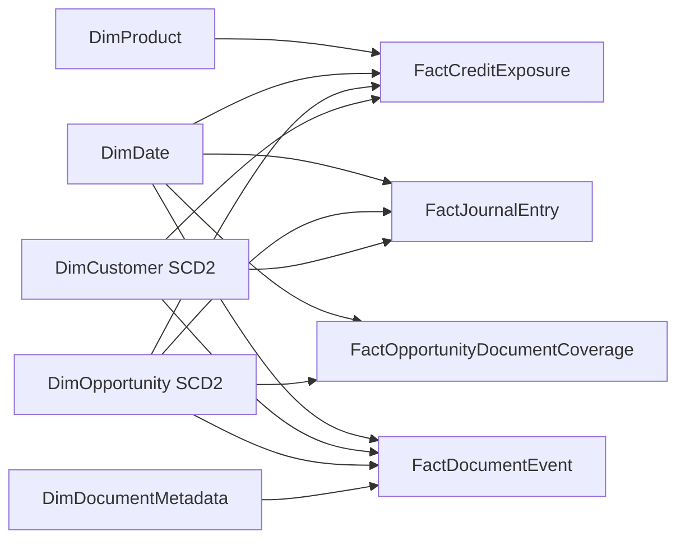

# Part 3 - Data Modeling, Semantic Layer & Governance

Date: 2026-06-25  
Scope: Data model design, governed semantic layer, and compliance controls for Shimon Ltd.

## 3.1 Conceptual → Logical → Analytical Model

### Conceptual model (business view)
Core business objects and relationships:
1. **Customer** applies for or holds credit opportunities.
2. **Opportunity** represents a lending case/product application tied to one customer.
3. **Document** is an evidence artifact for an opportunity (application forms, statements, contracts, summaries).
4. **Journal Entry** represents accounting postings tied to an opportunity and customer financial events.

Business cardinality:
1. One Customer to many Opportunities (1:many).
2. One Opportunity to many Documents (1:many).
3. One Opportunity to many Journal Entries (1:many).
4. One Customer to many Journal Entries (1:many).
5. Documents can have many tags and tags can apply to many documents (many:many) via bridge entity `DocumentTag`.

### Logical model (operational/conformed ERD)

#### Main entities and keys

| Entity | Primary key | Selected foreign keys | Notes |
|---|---|---|---|
| `Customer` | `customer_id` (surrogate), `source_customer_id` (alternate) | `golden_customer_id` -> `GoldenCustomer.golden_customer_id` | Stores current operational customer profile. |
| `GoldenCustomer` | `golden_customer_id` | N/A | Master record from MDM matching/merging process. |
| `Opportunity` | `opportunity_id` | `customer_id` -> `Customer.customer_id` | Opportunity lifecycle and exposure attributes. |
| `Document` | `document_id` | `opportunity_id` -> `Opportunity.opportunity_id`, `customer_id` -> `Customer.customer_id` | Metadata + pointers to original file and summary JSON. |
| `JournalEntry` | `journal_entry_id` | `opportunity_id` -> `Opportunity.opportunity_id`, `customer_id` -> `Customer.customer_id` | Debit/credit, amount, posting date, ledger account. |
| `DocumentTag` | (`document_id`, `tag_code`) | `document_id` -> `Document.document_id` | Resolves many:many for tagging/classification. |

#### Cardinality and relationship details
1. `GoldenCustomer` (1) -> `Customer` (many): one golden identity can map to multiple source records.
2. `Customer` (1) -> `Opportunity` (many): one customer can have many opportunities.
3. `Opportunity` (1) -> `Document` (many): one opportunity has many documents.
4. `Opportunity` (1) -> `JournalEntry` (many): financial postings by opportunity.
5. `Customer` (1) -> `JournalEntry` (many): enables customer-level exposure and accounting aggregation.
6. `Document` (1) -> `DocumentTag` (many), and tag code reused across many documents (many:many overall).

#### OLTP ERD vs analytical model (what is different and why)
1. **OLTP/ERD** is optimized for transaction integrity and update operations (3NF-style, many joins, current-state records).
2. **Analytical model** is optimized for fast aggregate queries, KPI consistency, and historical analysis (denormalized dimensions + additive facts).
3. In OLTP, status is overwritten; in analytical model, status history is preserved via SCD2 for trend and “as-of” reporting.
4. OLTP entity keys are source-system driven; analytical model introduces surrogate keys for stability and cross-source conformance.

### Analytical / dimensional model (star schema)

#### Star schema overview

#### Fact and dimension definitions

| Type | Table | Grain | Key columns | Main measures / attributes |
|---|---|---|---|---|
| Fact | `FactCreditExposure` | One row per opportunity snapshot date | `opportunity_sk`, `customer_sk`, `date_sk`, `product_sk` | `exposure_amount`, `approved_amount`, `utilized_amount`, `risk_weighted_exposure` |
| Fact | `FactJournalEntry` | One row per journal posting line | `journal_entry_id` (degenerate), `opportunity_sk`, `customer_sk`, `date_sk` | `debit_amount`, `credit_amount`, `balance_delta` |
| Fact | `FactOpportunityDocumentCoverage` | One row per opportunity per snapshot date | `opportunity_sk`, `date_sk` | `required_doc_count`, `received_doc_count`, `missing_doc_count`, `is_complete_flag` |
| Fact | `FactDocumentEvent` | One row per relevant document event | `document_sk`, `opportunity_sk`, `customer_sk`, `date_sk` | `is_latest_flag`, `processing_latency_sec`, `is_summary_available_flag` |
| Dimension | `DimCustomer` (SCD2) | One row per customer version | `customer_sk` (PK), `golden_customer_id`, `effective_from_dt`, `effective_to_dt`, `is_current` | Name, segment, risk_band, residency, masked identifiers |
| Dimension | `DimOpportunity` (SCD2) | One row per opportunity version | `opportunity_sk` (PK), `source_opportunity_id`, `effective_from_dt`, `effective_to_dt`, `is_current` | Status, stage, product_type, branch, approval tier |
| Dimension | `DimDocumentMetadata` | One row per document | `document_sk` (PK), `document_id` | Document type, version, source system, legal hold flag, storage URI reference (not raw content) |
| Dimension | `DimDate` | One row per calendar date | `date_sk` | Day/week/month/quarter/year attributes |
| Dimension | `DimProduct` | One row per product | `product_sk` | Product family, pricing class, regulatory category |

#### What is stored where
1. **Fact tables** store additive/semi-additive numeric events and snapshots for exposure, postings, and document completeness.
2. **Dimensions** store descriptive context used for slicing/filtering and historical as-of analysis.
3. **Document metadata** stores document identifiers, classification, ownership, timestamps, summary availability flags, and storage references.
4. **Semantic layer** stores governed metrics, business calculations, relationship logic, KPI definitions, and security predicates reused by BI and AI.

### SCD Type 2 application and justification
Apply SCD2 to:
1. `DimCustomer` for segment, risk band, KYC status, and residency changes.
2. `DimOpportunity` for lifecycle status/stage changes (e.g., Submitted -> Under Review -> Approved -> Closed).

Why SCD2 is required:
1. Credit and risk reporting needs “as-was” states for auditability.
2. Exposure trend analysis must reflect historical context at reporting date.
3. Regulatory and finance users need traceable metric restatements over time.

SCD2 implementation rules:
1. New surrogate key row created when tracked attribute changes.
2. Prior row closed by setting `effective_to_dt` and `is_current = false`.
3. Facts join to dimension version valid at event/snapshot time.

### Duplicate handling and golden customer record

Mastering strategy:
1. Standardize identifiers (national ID normalized, phone/email canonicalized, address parsed).
2. Deterministic match first (government ID, tax ID, exact legal entity ID).
3. Probabilistic/fuzzy match second (name + DOB + phone + address confidence score).
4. Survivorship rules create `GoldenCustomer` (source trust ranking, freshest verified field wins, manual steward override).
5. Maintain crosswalk table from all source customer IDs to `golden_customer_id`.

Controls:
1. Potential duplicates above confidence threshold routed to stewardship queue.
2. All merges/splits are audited with who/when/why and reversible lineage.
3. Facts reference conformed customer surrogate from golden mapping to avoid double counting exposure.

### Data contracts per source
Each contract includes schema, freshness SLA, quality rules, and change policy.

#### Contract A - Dynamics 365 CRM (Customers/Opportunities)
1. Mandatory fields: `source_customer_id`, `source_opportunity_id`, `status`, `modified_ts`.
2. Freshness: hourly incremental, max lag 90 minutes.
3. Quality gates: PK non-null, status in allowed domain, referential validity customer->opportunity.
4. Change policy: additive columns allowed with 14-day notice; breaking type/name changes require version bump.

#### Contract B - Business Central ERP (Journal Entries)
1. Mandatory fields: `journal_entry_id`, `posting_date`, `gl_account`, `amount`, `currency`, `opportunity_ref`.
2. Freshness: every 4 hours plus nightly reconciliation.
3. Quality gates: balanced debits/credits per voucher, valid posting period, currency code standard.
4. Change policy: chart-of-accounts mapping table maintained with controlled effective dates.

#### Contract C - CosmosDB summaries (Documents)
1. Mandatory fields: `document_id`, `opportunity_id`, `summary_json`, `summary_ts`, `source_uri`.
2. Freshness: hourly incremental by modified timestamp.
3. Quality gates: valid JSON schema, summary length bounds, required metadata completeness.
4. Change policy: JSON schema versioned; backward compatibility minimum one major version overlap.

#### Contract D - On-prem SQL Server (Legacy lending)
1. Mandatory fields: `legacy_customer_id`, `legacy_loan_id`, `outstanding_balance`, `as_of_date`.
2. Freshness: every 4 hours plus nightly checkpoint.
3. Quality gates: non-negative balances where applicable, duplicate key rejection, CDC sequence continuity.
4. Change policy: source DDL changes require approved release ticket and contract update.

#### Contract E - External SaaS API
1. Mandatory fields: `event_id`, `event_ts`, `customer_external_ref`.
2. Freshness: hourly micro-batch.
3. Quality gates: API pagination completeness, idempotent key uniqueness, timezone normalization.
4. Change policy: monitor API version deprecation; adapter layer isolates downstream schema from API drift.

## 3.2 Semantic Layer & AI-Readiness

### Governed semantic definitions
Create one enterprise semantic model over Gold marts with certified metrics:
1. `Total Credit Exposure` = sum of current eligible exposure across active opportunities, with currency normalization rule.
2. `Opportunities Missing Documents` = count where `missing_doc_count > 0` for required document policy in effect.
3. `Latest Document Summary` = summary from highest-priority latest eligible document by opportunity and document type policy.

For Shimon’s example questions:
1. "Total credit exposure of customer X" resolves through golden customer mapping + conformed exposure fact.
2. "Which opportunities are missing documents" resolves through document coverage fact and requirement rules.
3. "Summarize latest document for opportunity Y" resolves through document metadata filter + latest flag + governed summary field.

### Data-quality gates before semantic publication
1. Completeness checks on mandatory keys and business-critical attributes.
2. Referential checks across customer/opportunity/document/journal relationships.
3. Validity checks on status domains, amount ranges, and date logic.
4. Duplicate and anomaly checks (sudden exposure spikes, orphan documents).
5. Publication is blocked on failed critical rules; non-critical failures are flagged with data quality score.

### Lineage and traceability
1. Every semantic metric maps to source columns through lineage graph.
2. Metric definition includes owner, formula, filter scope, effective date, and change history.
3. AI answers return provenance payload: source table, record IDs, extraction timestamp, confidence and policy checks.

### Permission-aware grounded access (structured + unstructured)
1. AI retrieval only queries governed views/endpoints, never raw unrestricted storage.
2. Security predicates (RBAC/RLS/CLS) are applied before retrieval and before final answer rendering.
3. Document access checks enforce legal hold and classification restrictions.
4. If user is unauthorized for supporting evidence, assistant returns a policy-safe partial answer or denial.

### Hallucination prevention and grounding validation
1. Retrieval must return record-backed evidence IDs; no evidence means "insufficient data" response.
2. Numeric answers recomputed from governed metrics at query time or cached certified aggregates.
3. Consistency checks compare AI response values with semantic query output prior to response finalization.
4. Random audit sampling validates that answer citations map to real rows and latest approved snapshots.

### Why data-model structure directly affects AI answer quality
1. Conformed keys and SCD2 history prevent wrong joins and time-travel errors.
2. Clear fact/dimension separation reduces ambiguity in aggregation logic.
3. Golden customer mastering prevents duplicate counting and identity fragmentation.
4. Governed document metadata enables deterministic "latest" selection and missing-doc detection.
5. Stable semantic contracts reduce drift between what AI says and what BI reports.

## 3.3 Security, Governance & Compliance

### Access model: RBAC + ABAC + row/column controls
1. RBAC defines broad role permissions (Analyst, Credit Manager, Risk Officer, Data Steward, Admin).
2. ABAC adds policy conditions (region, branch, legal entity, clearance level, purpose-of-use).
3. RLS filters records by permitted branch/portfolio/customer scope.
4. CLS and masking hide sensitive fields (national ID, salary, raw score components) unless explicitly authorized.

### Classification, catalog, lineage, audit
1. Data classes: Public, Internal, Confidential, Restricted-PII, Restricted-Credit.
2. Catalog requires owner, steward, retention class, lawful basis, and approved consumers.
3. End-to-end lineage captured from ingestion to semantic objects to BI artifacts and AI endpoints.
4. Immutable audit logs record access, policy decisions, data changes, and model/metric version used per answer.

### Platform security controls
1. Encryption at rest and in transit (managed keys or customer-managed keys for sensitive domains).
2. Secrets in managed vault; no embedded credentials in notebooks/pipelines.
3. Private endpoints/VNet integration and deny-public-network posture for data services.
4. Tenant and environment separation with controlled cross-tenant sharing only via approved channels.

### Preventing unauthorized access in BI and AI layers
1. BI tools consume only certified semantic datasets/views with enforced RLS/CLS.
2. Direct query to raw restricted tables is denied for analyst roles.
3. AI service principal can access only governed semantic endpoints and allowed document metadata views.
4. AI responses post-filtered by the same access policies; prohibited fields never rendered.

### Dev/Test/Prod separation and CI/CD controls
1. Separate workspaces, storage, and service principals per environment.
2. Production data masked/tokenized in non-prod unless approved exception.
3. CI/CD uses least-privilege deployment identities; no developer direct prod write.
4. External sharing disabled by default; exception workflow with expiry, watermarking, and activity monitoring.

### Scenario enforcement (analyst can see exposure, not ID/salary/raw docs/scoring logic)
End-to-end enforcement design:
1. **Storage layer**: national ID, salary, and raw documents stored in restricted zones; analyst role has no read permission.
2. **Curated tables/marts**: exposure measures exposed; sensitive columns removed or masked in analyst-facing views.
3. **Semantic model**: publish `Total Credit Exposure` metric; exclude national ID/salary columns and scoring-rule internals from model.
4. **BI layer**: analyst role has RLS to assigned portfolio and cannot build reports from restricted datasets.
5. **AI assistant layer**: retrieval scope limited to analyst-approved semantic objects; prompt-time/tool-time policy checks deny restricted attributes and raw document fetch.
6. **Audit/monitoring**: all denied attempts and successful queries logged with user, role, object, and policy outcome.

## 3.4 Consistent Metrics Across Power BI & Qlik

To avoid duplicated logic and KPI drift, define metrics once in governed data products and semantic contracts.

Target pattern:
1. Build **single governed Gold marts** for finance/risk/operations with approved grains and conformed dimensions.
2. Maintain **single KPI definition registry** (formula, filters, grain, owner, version, effective date).
3. Expose metrics through **shared semantic access layer** (certified dataset + governed SQL endpoints/views).
4. Force both Power BI and Qlik to consume the same governed objects, not independent transformations.
5. Reuse identical access policies (RLS/CLS) across tools via centralized identity groups.

Practical implementation for Shimon:
1. `Total Credit Exposure`, `Missing Documents`, and related KPIs are computed in governed marts/semantic views.
2. Power BI model references certified semantic objects without custom KPI redefinition in reports.
3. Qlik loads from the same governed endpoints and is prohibited from re-deriving enterprise KPIs upstream.
4. AI access uses the same semantic endpoints and KPI registry, ensuring answers match BI numbers.
5. Metric change management uses versioned releases and regression tests that compare Power BI, Qlik, and AI outputs on control datasets.

Governance operating model:
1. KPI owner (business) + data product owner (IT) jointly approve metric changes.
2. Changes require impact analysis, lineage update, and backtest against historical periods.
3. Certification badge applies only to datasets/views that pass quality and policy checks.
